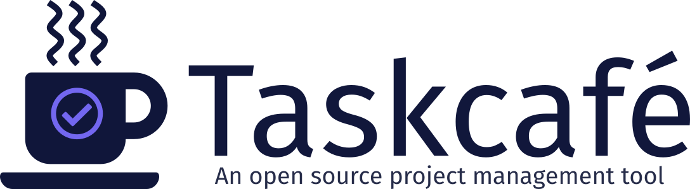
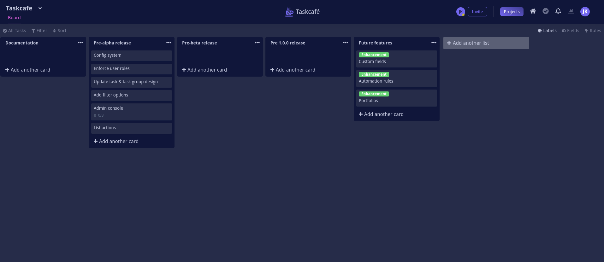

<p align="center">
 
</p>
<p align="center">
  <a href="https://discord.gg/JkQDruh">
    
  </a>
  <a href="https://github.com/JordanKnott/taskcafe/releases">
    
  </a>
  <a href="https://hub.docker.com/repository/docker/taskcafe/taskcafe">
    
  </a>
  <a href="https://goreportcard.com/report/github.com/JordanKnott/taskcafe">
    
  </a>
  <a href="">
    
  </a>
</p>

  <p align="center">
    <a href="https://github.com/JordanKnott/taskcafe/issues/new?assignees=&labels=&template=bug_report.md&title=">Report Bug</a>
    ·
    <a href="https://github.com/JordanKnott/taskcafe/discussions/new?category=ideas">Request Feature</a>
     ·
    <a href="https://github.com/JordanKnott/taskcafe/discussions/new?category=q-a">Ask a Question</a>
  </p>
<p align="center">
Was this project useful? Please consider <a href="https://www.buymeacoffee.com/jordanknott">donating</a> to help me improve it!
</p>
<p align="center">
 This project is still in <strong>alpha development</strong></p>



## Features

The following features have been implemented:

- Manage tasks through a Kanban board interface (set due dates, labels, add checklists)
- View all your current assigned tasks through the My Tasks view
- Personal projects
- Task comments and activity

This project is still in active development, so some options may not be fully implemented yet.

**For updates on development, join the [Discord server](https://discord.gg/JkQDruh).**

For a list of planned features, check out the [Roadmap](https://github.com/JordanKnott/taskcafe/wiki/Roadmap)!

## Installation

### With docker & docker-compose

You'll need both [docker](https://www.docker.com/) & [docker-compose](https://docs.docker.com/compose/install/) installed.

First clone the repository:

``` bash
git clone https://github.com/JordanKnott/taskcafe && cd taskcafe
```

Now do the following:

``` bash
docker-compose -p taskcafe up -d
```

This will start a postgres instance as well as a taskcafe instance.

The second command runs the database schema migrations.

If you visit [http://localhost:3333](http://localhost:3333), you will get redirected to the installation
screen so that you can create the first system user.

### From Source

You'll need [Golang](https://golang.org/dl/) installed on your machine.

Next, clone the repository:

``` bash
git clone https://github.com/JordanKnott/taskcafe && cd taskcafe
```

Next we need to build the binary. This project uses [Mage](https://magefile.org/) for its build tool.

``` bash
go run cmd/mage/main.go install
go run cmd/mage/main.go build
```

This will:

- Install all yarn packages for the frontend
- Build the React frontend
- Embed the React frontend in the binary
- Compile the final exectuable binary

The newly created `taskcafe` binary can be found in the __dist__ folder.

It contains everything neccessary to run except the config file. An example config file can be found in `conf/app.example.toml`.

For more information on configuration, please read the [wiki](https://github.com/JordanKnott/taskcafe/wiki/Configuration).
The config will need to be copied to a `conf/app.toml` in the same place the binary is.

Make sure to fill out the database section of the config in order to connect it to your database.

Then run the database migrations with `taskcafe migrate`.

Now you can run the web interface by running `taskcafe web`.

[A more detailed guide for installing on Ubuntu/Debian](https://github.com/JordanKnott/taskcafe/wiki/Installation-(ubuntu-debian))

## How is this different from X (Trello, NextCloud, etc)?

One of the primary goals of Taskcafe is to provide a project management tool that I personally enjoy using for my
own projects and fits my workflow.

During alpha development, the current plan is to build the "basic" features - features that are pretty much
standard across all kanban boards / project management tools.

Once Taskcafe is out of alpha, there are many features that I plan on adding that will differentiate it from other products (check out the [Roadmap](https://github.com/JordanKnott/taskcafe/wiki/Roadmap) for ideas on future plans).

## Contributing & community

If you have questions regarding how to use Taskcafe, check out the [discord server](https://discord.gg/JkQDruh).

If you're interesting in contributing to Taskcafe, please read the [contribution guide first](https://github.com/JordanKnott/taskcafe/blob/master/CONTRIBUTING.md)!

There is also a [Code of Conduct](https://github.com/JordanKnott/taskcafe/blob/master/CODE_OF_CONDUCT.md) as well.

## License

[MIT License](LICENSE)
